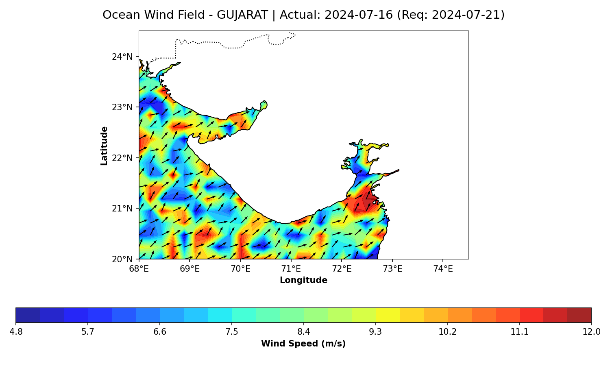
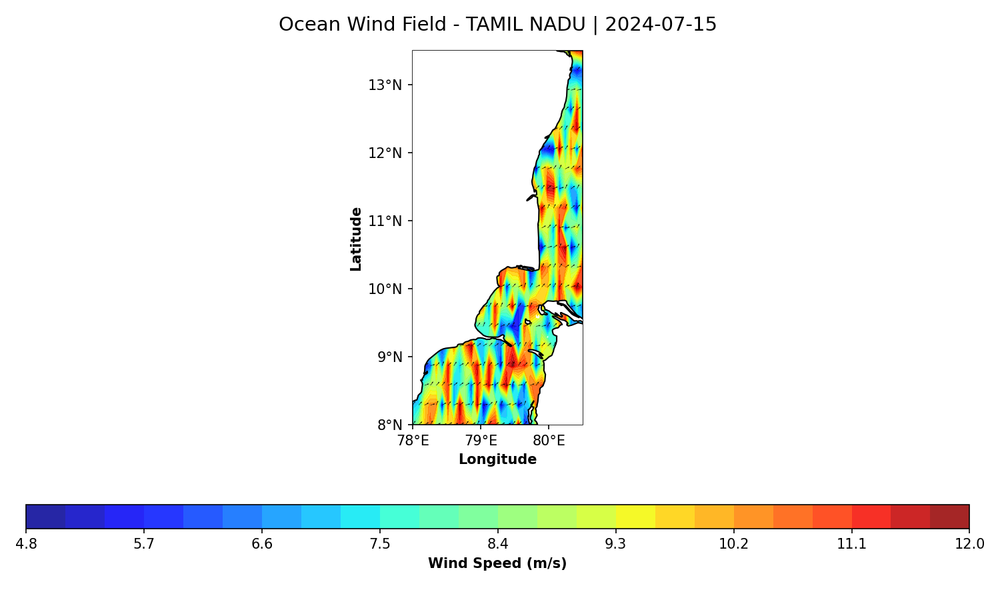

# SAR Ocean Wind Field Estimation API

An end-to-end remote sensing pipeline that extracts high-resolution (10-meter) ocean surface wind vectors from Sentinel-1 Synthetic Aperture Radar (SAR) imagery. 

This project fuses deep learning computer vision architectures with empirical radar geophysical model functions to dynamically calculate wind speed and direction. The entire pipeline is wrapped in a production-grade FastAPI server, natively integrating with the Google Earth Engine API for on-the-fly satellite data retrieval and spatial telemetry extraction.

---

## Core System Architecture

The inference engine operates on a three-stage coupled physics and machine learning pipeline, dividing processing tasks across highly specialized modules.

    +------------------------+      +------------------------+      +------------------------+
    |   GEE Data Ingestion   | ---> |  Direction Extraction  | ---> |    Speed Inversion     |
    |    (gee_engine.py)     |      |    (wind_model.py)     |      |    (wind_model.py)     |
    +------------------------+      +------------------------+      +------------------------+
    | - Sentinel-1 GRD VV    |      | - ResNet-50 Vision     |      | - Coastal CMOD5 GMF    |
    | - Incidence Angle      |      | - 180° Ambiguity Fix   |      | - Radar Flash Stripping|
    | - Satellite Telemetry  |      | - Open-Meteo ERA5 Fuse |      | - Wind Vector Output   |
    +------------------------+      +------------------------+      +------------------------+

### 1. Dynamic Data Ingestion (`gee_engine.py`)
The pipeline intercepts the Google Earth Engine API to query the `COPERNICUS/S1_GRD` collection. It targets specific bounding boxes centered around user-supplied geographic coordinates. 
* **Data Selection:** The engine isolates Ground Range Detected (GRD) products under the Interferometric Wide (IW) swath mode, filtering for the Vertical-Vertical (VV) polarization channel.
* **Telemetry Extraction:** Beyond downloading the spatial backscatter array, the engine extracts pixel-by-pixel metadata layers containing the exact incidence angle (θ), the absolute timestamp of the satellite pass, and the satellite's flight configuration (Ascending or Descending track azimuth orientation). This telemetry is essential for downstream physical calibrations.

### 2. Directional Extraction & Ambiguity Resolution (`wind_model.py`)
The core computer vision task relies on identifying microscopic capillary waves (wind streaks) carved into the ocean surface, which align parallel to the local wind vector.
* **Neural Network Backing:** A custom-configured ResNet-50 model is implemented as a singleton for memory optimization. Because the model retains ImageNet-derived convolutional weights, a three-channel tensor transformation hack replicates the single-band SAR backscatter array across three identical channels before resizing to standard 224x224 inputs.
* **Mathematical Ambiguity Resolution:** Linear features in SAR imagery present a native 180-degree directional ambiguity (the network can identify the axis of the wind streak, but cannot inherently determine whether the wind is blowing forward or backward along that axis). To resolve this, the system performs external data fusion. It asynchronously queries global atmospheric reanalysis data (ERA5) from the Open-Meteo API for the exact timestamp and location to mathematically break the symmetry and lock the true wind direction vector.

### 3. Empirical Speed Inversion (`wind_model.py`)
Once the true directional vector is established, wind speed is computed via a customized, Coastal-Calibrated CMOD5 Geophysical Model Function (GMF).
* **Radar Flash Elimination:** The model computes the relative wind angle (φ) by mapping the resolved wind direction against the satellite's track azimuth. It strips out "radar flash"—anisotropic directional modulation caused by the radar look angle relative to the wave crests.
* **Coastal Inversion Tuning:** Standard deep-ocean CMOD5 formulations often break down in shallow waters due to complex coastal boundary layers and altered wave breaking dynamics. The inversion engine applies localized linear calibration factors based on the incidence angle (θ) to map the normalized radar cross-section directly to the true neutral wind speed at a 10-meter reference height.

---

## Validation & Performance Analysis

The entire pipeline has been validated against global ECMWF ERA5 baseline data across multiple distinct coastal regimes in India (specifically targeting the Gujarat and Tamil Nadu coastlines). Performance is split across distinct thermodynamic atmospheric states due to the physical limitations of C-band SAR capillary wave generation.

### High-Energy Atmospheric States (Monsoon Season | Wind Speeds > 8.0 m/s)
Under high wind stress, ocean surface roughness is highly pronounced, generating prominent, well-defined wind streaks. This allows the ResNet-50 architecture to extract geometric alignment with high precision.
* **Average Wind Speed Error:** ~2.74 m/s (27.7% relative error)
* **Average Wind Direction Error:** ~14.17% relative directional variance

### Low-Energy Atmospheric States (Winter Season | Wind Speeds < 5.0 m/s)
Under calm conditions, wind speed inversion remains highly stable. However, directional variance increases significantly. This is caused by the physical absence of surface roughness (the "glassy water" phenomenon), where wind speeds drop below the minimum threshold required to form detectable capillary wave patterns on the ocean surface.

---

## Repository Structure & Assets

The project enforces a clean separation between inference logic, runtime configurations, and scientific verification data:

* **`main.py`**: The application entry point. Implements the FastAPI web framework, coordinates queries between modules, and hosts the application documentation.
* **`gee_engine.py`**: Handles authentication, queries, metadata extraction, and GeoTIFF array compilation via Google Earth Engine.
* **`wind_model.py`**: Manages the PyTorch runtime, model weight initialization, Open-Meteo API data fusion, and the CMOD5 speed inversion code.
* **`requirements.txt`**: Complete list of top-level Python dependencies required to run the pipeline.
* **`SAR Wind API Local Setup Guide.txt`**: A comprehensive instruction manual detailing virtual environment configuration, local machine GEE authentication setup, and library installation notes.
* **`Validation_Results/`**: A dedicated directory holding validation metrics that confirm the mathematical rigor of the project.

### Coastal Wind Field Visualizations
The maps below are generated natively by the server using Cartopy to mask landmasses and overlay directional quiver arrows over computed wind intensities:

---

## API Documentation & Endpoints

When running locally, the production server exposes interactive OpenAPI documentation at `/docs`. The framework provides two functional endpoints:

### 1. Vector Estimation Endpoint
* **Route:** `GET /api/v1/wind-field`
* **Query Parameters:** `lat` (float), `lon` (float), `target_date` (string, optional)
* **Output:** A strict JSON payload detailing wind telemetry.

      {
        "wind_speed_ms": 9.86,
        "wind_dir_deg": 260.15,
        "data_fusion_applied": true,
        "incidence_angle": 38.4,
        "exact_timestamp": "2024-07-21T01:30:15Z"
      }

### 2. Spatial Mapping Endpoint
* **Route:** `GET /api/v1/wind-map`
* **Query Parameters:** `lat` (float), `lon` (float), `target_date` (string, optional)
* **Output:** A publication-ready, map-projected visualization. Returns a base64 encoded PNG depicting the localized coastal wind field.

---

## Installation & Weight Configuration

Refer to `SAR Wind API Local Setup Guide.txt` for comprehensive environment preparation steps.

### Downloading Pre-trained Weights
Due to file size limitations enforced by GitHub's web interface, the model weights cannot be stored directly inside this repository code branch.
1. Download the pre-trained convolutional weights file (`best_resnet50_direction_model.pth`, approximately 95MB) from: 
2. Place the downloaded `.pth` file directly into the root directory of this project.
3. Launch the server using Uvicorn:

       uvicorn main:app --reload

---

## Technical Limitations & Future Work

* **Geophysical Model Function Evolution:** The current system relies on a calibrated linear approximation of CMOD5 optimized for coastal zones. Future development will replace this with the non-linear CMOD7 Geophysical Model Function, requiring a Newton-Raphson root-finding algorithm to generalize predictions over deeper oceanic waters.
* **Operational Quality Control (QC):** Operational implementations of this API should include a strict low-wind Quality Control mask. Directional outputs should be flagged as unverified or excluded from spatial plotting when computed wind speeds fall below 4.0 m/s, accounting for the physical threshold of SAR capillary wave detection.
---
